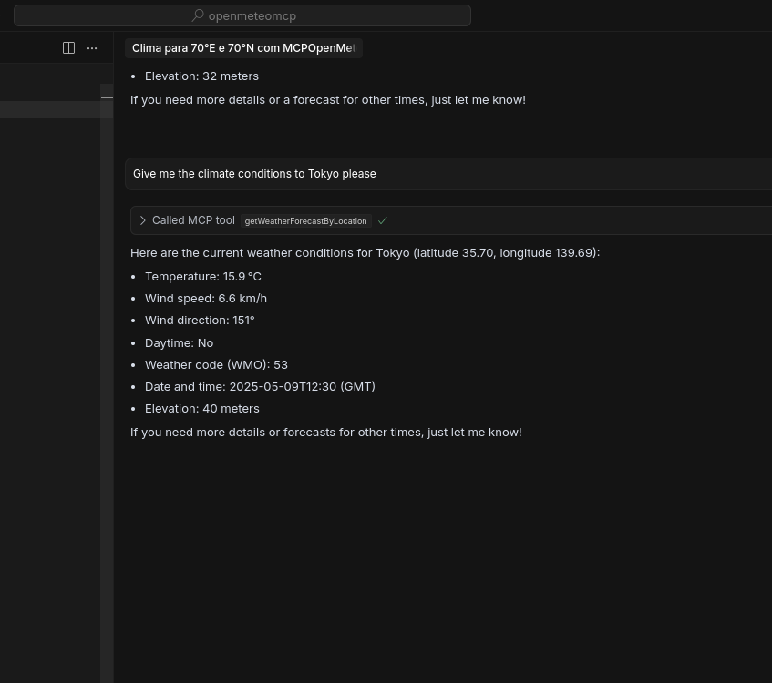

# MCP Sample Java Application

This is a minimal Spring Boot application implementing an MCP (Model Controller Provider) server using Spring AI.  
It is designed to be used as an external MCP server for client applications.

---

## 🚀 Getting Started

### 1. Clone the Project

```bash
    git clone git@github.com:Saularch97/mcp-java-sample.git
    cd openmeteomcp
```

### 2. Build the Project
```bash
  mvn clean package
```

The output will be located at **target/openmeteomcp-0.0.1-SNAPSHOT.jar**

## ⚙️ Client Configuration
To run the server from your client, insert the following configuration:

```json
{
  "mcpServers": {
    "mcpopenmeteo": {
      "command": "java",
      "args": [
        "-jar",
        "<PATH_TO_YOUR_PROJECT>/openmeteomcp/target/openmeteomcp-0.0.1-SNAPSHOT.jar",
        "--port",
        "8080",
        "--host",
        "localhost"
      ]
    }
  }
}
```
Replace <PATH_TO_YOUR_PROJECT> with the actual path to your project directory.

## 📦 Project Dependencies

The project depends on the following Spring AI starter module:
```xml
<dependencies>
    <dependency>
        <groupId>org.springframework.ai</groupId>
        <artifactId>spring-ai-starter-mcp-server-webmvc</artifactId>
    </dependency>
</dependencies>
```
## 🧰 Requirements
- Java 21
- Maven 3.8+

To use the project just connect with an client, Cursor, ClaudeDesktop, Vscode etc.




